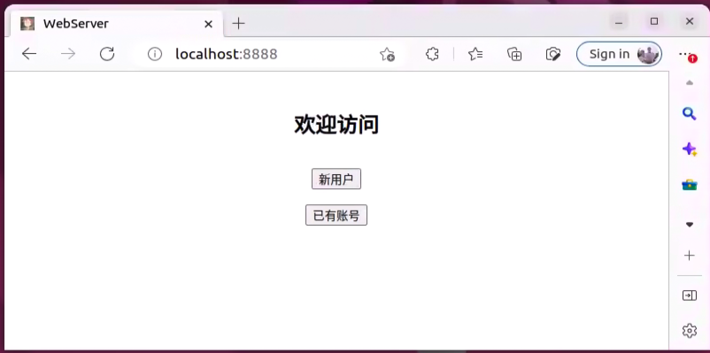
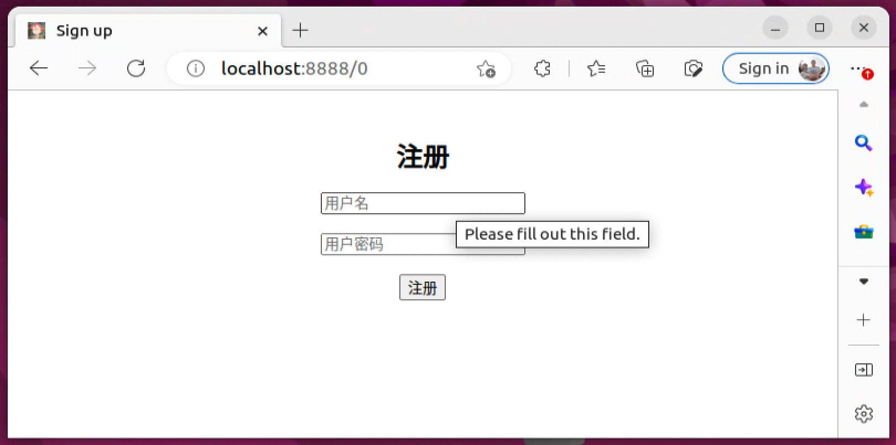
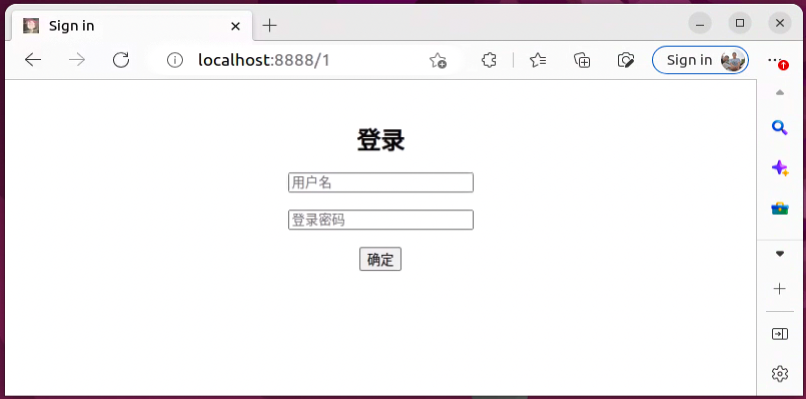
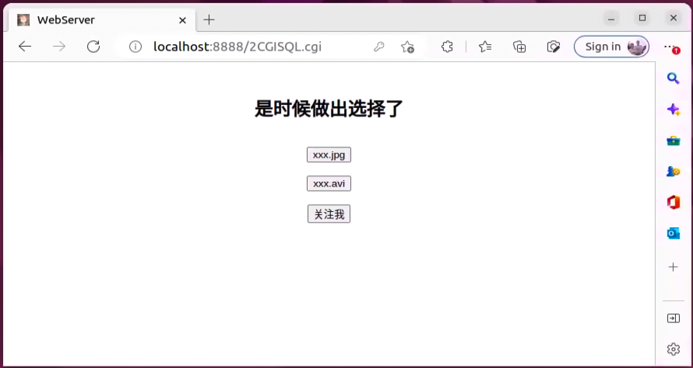
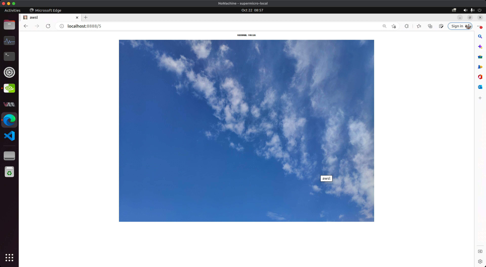
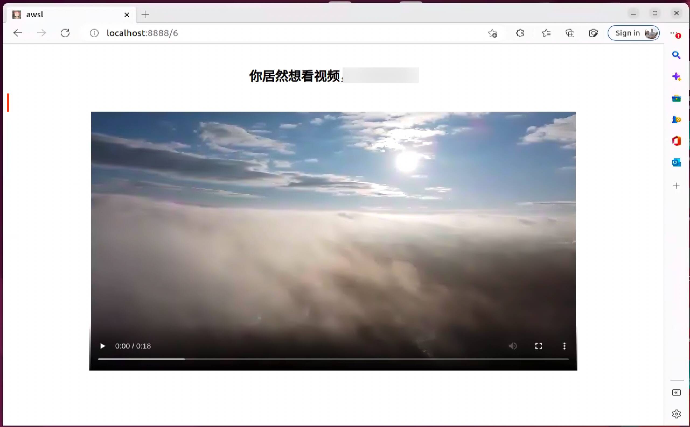
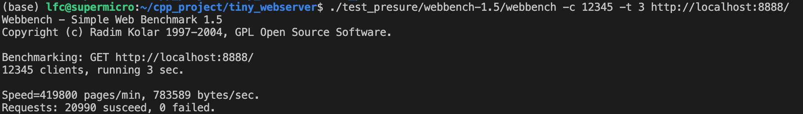

# 项目介绍

该WebServer项目结合MySQL数据库实现了用户注册、登陆功能，可以向服务器请求图片或视频，支持大文件传输。

## 后端实现细节

1. 使用工作线程池 + epoll模拟Proactor模式，支持切换LT/ET工作模式
2. 主线程和工作线程之间通过一个线程安全的工作请求队列实现解耦
3. 为提高并发访问数据库的性能，实现了数据库连接池，支持RAII机制
4. 使用主从状态机实现HTTP请求解析的状态转换，支持GET和POST请求
5. 实现了异步日志系统，其中实现了基于数组的线程安全阻塞队列
6. 实现了定时器功能，用于处理非活动连接，减轻服务器压力

## 前端页面展示

* 欢迎页面



* 注册页面



* 登录页面



* 登录成功后的欢迎界面



* 请求图片文件



* 请求视频文件



# 项目测试

## 测试环境

* Ubuntu 22.04 (5.15.0-56-generic)
* MySQL 8.0.33

## 建立数据库

* ```C++
  // 建立yourdb库
  create database yourdb;

  // 创建user表
  USE yourdb;
  CREATE TABLE user(
      username char(50) NULL,
      passwd char(50) NULL
  )ENGINE=InnoDB;

  // 添加数据
  INSERT INTO user(username, passwd) VALUES('name', 'passwd');
  ```


## 参数修改

* 修改main.c中的数据库初始化信息

```C++
  // root root修改为服务器数据库的登录名和密码
  // qgydb修改为上述创建的yourdb库名
  connPool->init("localhost", "root", "root", "yourdb", 3306, 8);
```

* 修改http_conn.cpp中的root路径

  ```C++
  // 修改为root文件夹所在路径
  const char* doc_root="/home/qgy/TinyWebServer/root";
  ```

## 编译测试

* 编译makefile文件生成server可执行文件

  ```
  make server
  ```
* 启动server，后面跟的参数是端口号

  ```C++
  ./server 8888
  ```
* 浏览器端通过如下形式访问

  ```C++
  ip:port
  ```

## 压力测试(webbench)

```bash
./test_presure/webbench-1.5/webbench -c 12345 -t 3 http://localhost:8888/
```

* `-c` 客户端数量
* `-t` 测试时间


测试截图：


